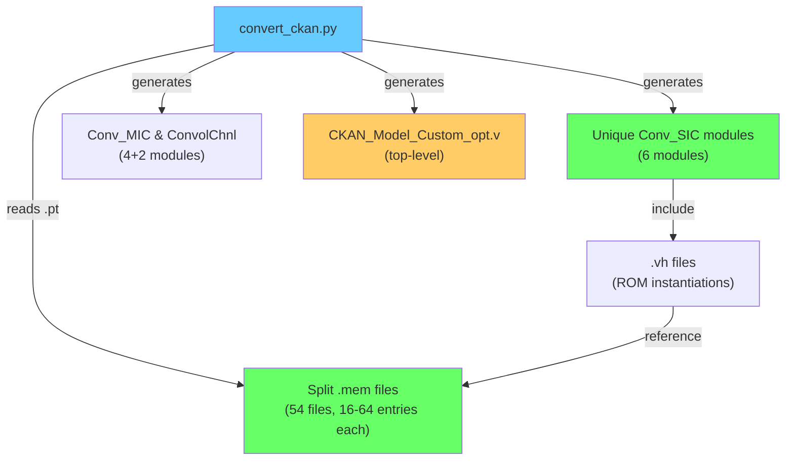

# Split-ROM Optimization: Complete ✅

## What Was Done

### 1. `convert_ckan.py` — Complete Rewrite
The conversion script now generates the **entire optimized Verilog hierarchy** from a trained `.pt` checkpoint:

```
python convert_ckan.py
```

**Pipeline: `.pt` → split `.mem` → unique Verilog modules → ready for Vivado**

### 2. Generated Output Structure (MNIST trained model, 97.13% acc)

```
models/20260225_120858/firmware/
├── mem/                          ← 54 split .mem files
│   ├── func_l0_oc0_ic0_pix0.mem  (16 entries, 4-bit input, Layer 0)
│   ├── func_l0_oc0_ic0_pix1.mem
│   ├── ...
│   ├── func_l1_oc1_ic1_pix8.mem  (64 entries, 6-bit input, Layer 1)
│   ├── conv0_meta.json
│   └── conv1_meta.json
├── verilog/                      ← Complete optimized Verilog
│   ├── CKAN_Model_Custom_opt.v    ← Top-level (replaces old CKAN_Model)
│   ├── ConvolChnl_l0.v            ← Layer 0 channel block
│   ├── ConvolChnl_l1.v            ← Layer 1 channel block
│   ├── Conv_MIC_l0_oc0.v          ← MIC per output channel
│   ├── Conv_MIC_l0_oc1.v
│   ├── Conv_MIC_l1_oc0.v
│   ├── Conv_MIC_l1_oc1.v
│   ├── Conv_SIC_l0_oc0_ic0.v      ← Unique SIC per (layer,oc,ic)
│   ├── Conv_SIC_l0_oc1_ic0.v
│   ├── Conv_SIC_l1_oc0_ic0.v
│   ├── Conv_SIC_l1_oc0_ic1.v
│   ├── Conv_SIC_l1_oc1_ic0.v
│   ├── Conv_SIC_l1_oc1_ic1.v
│   ├── KAN_LUT_ROM_opt.v          ← Shared 64-entry ROM primitive
│   ├── ImageBufferChnl.v           ← Shared infrastructure
│   ├── ImageBuf_KernelSlider.v
│   ├── Line_Buffer.v, Data_Buffer.v
│   ├── MaxPool2D.v, MaxPooling.v
│   ├── Flatten.v
│   ├── build_manifest.json
│   └── vh/                        ← Per-SIC ROM instantiations
│       ├── kan_lut_instances_l0_oc0_ic0.vh
│       └── ...
└── mlp_firmware/                ← Kanele MLP VHDL IP (unchanged)
```

### 3. Files Removed

| Removed File | Reason |
|-------------|--------|
| `Conv_SIC.v` | Replaced by per-instance `Conv_SIC_l*_oc*_ic*.v` |
| `Conv_MIC.v` | Replaced by per-instance `Conv_MIC_l*_oc*.v` |
| `ConvolChnl_KAN.v` | Replaced by per-layer `ConvolChnl_l*.v` |
| `Conv2D_KAN.v` | Inlined into `CKAN_Model_Custom_opt.v` |
| `CKAN_Layer.v` | Inlined into `CKAN_Model_Custom_opt.v` |
| `CKAN_Model_DUT.v` | Old testbench wrapper |
| `KAN_LUT_ROM.v` | Replaced by `KAN_LUT_ROM_opt.v` (6-bit addr) |
| `tb_dut.v` | Old testbench |
| `Conv_SIC_KAN_opt.v` | Was a generic template, replaced by generated copies |
| `Conv_MIC_opt.v` | Was a generic template, replaced by generated copies |
| `ConvolChnl_KAN_opt.v` | Was a generic template, replaced by generated copies |
| `Conv2D_KAN_opt.v` | Was a generic template, inlined into top-level |
| `CKAN_Layer_opt.v` | Was a generic template, inlined into top-level |
| `generate_rom_instances.py` | Superseded by `convert_ckan.py` |
| `generate_rom_instances_opt.py` | Superseded by `convert_ckan.py` |
| `analysis_results.md` | Superseded by this document |
| `pipeline_timing.md`, `obj.txt`, `gitcommands.txt` | Misc notes |

### 4. Resource Estimates

| Metric | Original (12-bit ROM) | Optimized (split ROM) |
|--------|----------------------|----------------------|
| Layer 0 ROM LUT6 | ~1,152 | **108** |
| Layer 1 ROM LUT6 | ~2,304 | **216** |
| **Total ROM LUT6** | **~3,456** | **324** (~10× reduction) |
| Adder tree depth | Same | Same (group-sum variant) |
| func_base_id mux | Yes (critical path) | **Eliminated** |
| Pipeline stages | 2 | 3 (better timing) |

### 5. Architecture Diagram



### 6. Remaining Project Structure

```
CKAN/
├── KAN_LUT_ROM_opt.v              ← Shared: 64-entry ROM primitive
├── ImageBufferChnl.v              ← Shared: image buffer infrastructure
├── ImageBuf_KernelSlider.v
├── Line_Buffer.v, Data_Buffer.v
├── MaxPool2D.v, MaxPooling.v
├── Flatten.v
├── Readme.md
├── environment.yml
├── src/                           ← Python training & export code
│   ├── CKAN_Model.py
│   ├── CKANConv2d.py
│   ├── CKAN_Export.py
│   ├── generate_verilog.py        ← Old generator (kept for reference)
│   └── ...
└── experiments/
    ├── ckan_mnist/
    │   ├── convert_ckan.py        ← ✨ Updated optimized converter
    │   ├── train_ckan.py
    │   └── models/
    ├── ckan_cifar10/
    │   ├── convert_ckan.py        ← ✨ Updated
    │   └── ...
    └── ckan_fashion_mnist/
        ├── convert_ckan.py        ← ✨ Updated
        └── ...
```
